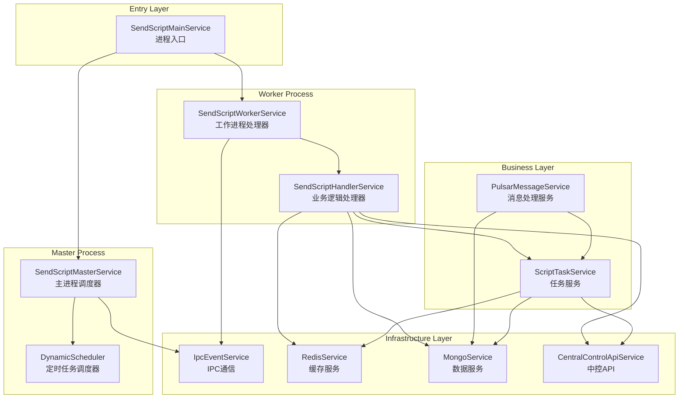
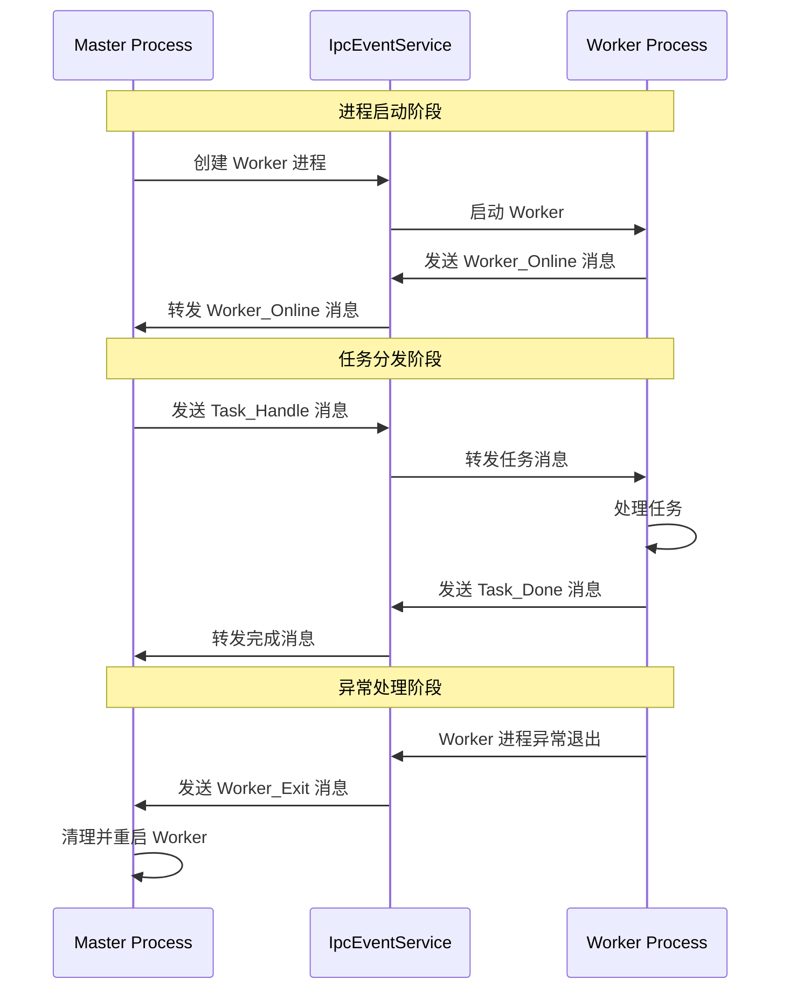
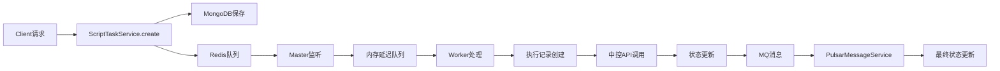

# 脚本下发服务组件交互说明

## 1. 组件概览

### 1.1 核心组件列表

| 组件名称 | 文件位置 | 主要职责 |
|---------|----------|----------|
| SendScriptMainService | `src/microservices/send-script-main.ts` | 进程启动和管理 |
| SendScriptMasterService | `src/modules/send-script-main/send-script-master.service.ts` | 主进程任务调度 |
| SendScriptWorkerService | `src/modules/send-script-main/send-script-worker.service.ts` | 工作进程任务处理 |
| SendScriptHandlerService | `src/modules/send-script-main/send-script-handler.service.ts` | 业务逻辑处理 |
| ScriptTaskService | `src/modules/script-task/script-task.service.ts` | 任务CRUD操作 |
| PulsarMessageService | `src/mq/pulsar-message-service.ts` | MQ消息处理 |
| IpcEventService | `src/common/ipc-event.service.ts` | 进程间通信 |

### 1.2 外部依赖组件

| 依赖组件 | 用途 | 交互方式 |
|---------|------|----------|
| Redis | 任务队列、设备锁 | RedisService |
| MongoDB | 数据持久化 | MongoService |
| Pulsar MQ | 消息队列 | PulsarService |
| 中控API | 设备管理、脚本下发 | CentralControlApiService |

## 2. 组件交互关系

### 2.1 组件依赖关系图



### 2.2 进程间通信关系



## 3. 核心组件详细说明

### 3.1 SendScriptMasterService (主进程调度器)

#### 3.1.1 主要属性
```typescript
class SendScriptMasterService {
  private readonly workers: TaskWorker[]        // Worker进程列表
  private readonly waitFreshQueue: PushScriptTaskDto[]  // 刷新队列
  private readonly waitQueue: PushScriptTaskDto[]      // 等待队列
  private readonly processingSet: Set<string>          // 处理中任务集合
}
```

#### 3.1.2 核心方法交互

| 方法名 | 调用频率 | 交互对象 | 功能描述 |
|--------|----------|----------|----------|
| `Init()` | 启动时1次 | cluster, IpcEventService | 创建Worker进程，建立通信 |
| `listenNotice()` | 持续循环 | RedisService | 监听Redis任务队列 |
| `checkTask()` | 每5秒 | 内存队列 | 检查延迟队列，分发任务 |
| `loadDelayScriptTaskData()` | 每5分钟 | MongoService | 加载预约任务到内存 |
| `dispatchToWorker()` | 按需调用 | IpcEventService | 任务负载均衡分发 |

#### 3.1.3 负载均衡算法
```typescript
// 设备维度负载均衡
selectWorkerForDevice(readyWorkers: TaskWorker[], deviceId: string): TaskWorker {
  // 1. 优先选择未处理该设备的Worker
  const availableWorkers = readyWorkers.filter(w => 
    !w.deviceTasks.has(deviceId) || w.deviceTasks.get(deviceId) === 0
  );
  
  if (availableWorkers.length > 0) {
    // 选择总任务数最少的
    return _.minBy(availableWorkers, 'taskCount')!;
  }
  
  // 2. 选择处理该设备任务最少的Worker
  return workersWithDeviceTasks.sort((a, b) => {
    if (a.deviceTaskCount !== b.deviceTaskCount) {
      return a.deviceTaskCount - b.deviceTaskCount;
    }
    return a.worker.taskCount - b.worker.taskCount;
  })[0].worker;
}
```

### 3.2 SendScriptWorkerService (工作进程处理器)

#### 3.2.1 主要属性
```typescript
class SendScriptWorkerService {
  logger: Logger                              // 日志记录器
  ipc: IpcEventService                       // IPC通信服务
  workingCount: number                       // 当前处理任务数
}
```

#### 3.2.2 任务处理流程
```typescript
async run(id: string, deviceLockValue: number) {
  // 1. 查询任务记录
  let scriptTask = await this.mongo.findOne(ScriptTaskEntity, {...});
  
  // 2. 创建执行记录快照
  const taskExecRecord = await this.mongo.save(taskExecRecordModel);
  
  // 3. 更新任务状态
  scriptTask.status = ScriptTaskStatus.Running;
  scriptTask = await this.mongo.save(scriptTask);
  
  // 4. 执行业务逻辑
  await this.sendScriptHandlerSvc.taskPreprocess(scriptTask);
  await this.sendScriptHandlerSvc.sendScript(scriptTask, taskExecRecord);
  
  // 5. 更新发送成功状态
  scriptTask.status = ScriptTaskStatus.Send_Success;
  await this.mongo.save(scriptTask);
}
```

### 3.3 SendScriptHandlerService (业务逻辑处理器)

#### 3.3.1 关键方法

| 方法名 | 功能 | 交互对象 |
|--------|------|----------|
| `taskPreprocess()` | 任务预处理 | ScriptTaskEntity |
| `sendScript()` | 下发脚本到中控 | CentralControlApiService |
| `handleDeviceLockedFail()` | 处理设备锁获取失败 | MongoService |
| `handleRunFail()` | 处理运行失败 | MongoService |
| `checkScriptTaskTimeOut()` | 检查任务超时 | MongoService, RedisService |

#### 3.3.2 超时检查逻辑
```typescript
async checkScriptTaskTimeOut() {
  // 查询发送成功但超时的任务
  const timeoutTasks = await this.mongo.find(ScriptTaskEntity, {
    where: {
      status: ScriptTaskStatus.Send_Success,
      updatedAt: { $lte: timeoutThreshold }
    }
  });
  
  // 处理超时任务
  for (const task of timeoutTasks) {
    if (task.isRetry && task.retryCount < MAX_RETRY_COUNT) {
      // 设置为失败待重试
      await this.setTaskFailWaitingRetry(task);
    } else {
      // 设置为最终失败
      await this.setTaskFinalFail(task);
    }
  }
}
```

### 3.4 PulsarMessageService (消息处理服务)

#### 3.4.1 消息处理流程
```typescript
@PulsarConsumer('adbnode-task-log-new', {...})
async taskLogConsumer(topic: string, messages: PulsarConsumerData[], consumer: Consumer) {
  // 1. 按日志类型分类消息
  const successMsgs = messages.filter(msg => msg.data?.logType === LogType.SUCCESS);
  const errMsgs = messages.filter(msg => [LogType.ERROR, LogType.SYSTEM_ERROR].includes(msg.data?.logType));
  
  // 2. 并行处理
  await Promise.all([
    this.saveLogs(messages),              // 保存所有日志
    this.processErrorMessages(errMsgs),   // 处理失败消息
    this.processSuccessMessages(successMsgs)  // 处理成功消息
  ]);
  
  // 3. 确认消息处理完成
  await Promise.all(messages.map(it => consumer.acknowledgeId(it.messageId)));
}
```

### 3.5 ScriptTaskService (任务服务)

#### 3.5.1 主要CRUD操作

| 方法名 | 功能 | 返回值 |
|--------|------|--------|
| `create()` | 创建脚本任务 | `{id: string}` |
| `info()` | 查询任务详情 | `ScriptTaskEntity \| null` |
| `list()` | 任务列表查询 | `ListResultDto<ScriptTaskEntity>` |
| `cancel()` | 取消任务 | `boolean` |
| `updateTaskSucByRecordIds()` | 批量更新任务成功 | `void` |
| `updateTaskFailByRecordIds()` | 批量更新任务失败 | `void` |

#### 3.5.2 设备锁管理
```typescript
// 批量释放设备锁
private async batchReleaseDeviceLocks(records: Array<{deviceId?: string, deviceLockValue?: number}>) {
  // 按设备分组，避免重复释放
  const deviceLockMap = new Map<string, {lockValue: number, taskId: string}>();
  
  for (const record of records) {
    const {deviceId, deviceLockValue, taskId} = record;
    if (deviceId && deviceLockValue) {
      // 保留最新的lockValue
      const existing = deviceLockMap.get(deviceId);
      if (!existing || deviceLockValue > existing.lockValue) {
        deviceLockMap.set(deviceId, {lockValue: deviceLockValue, taskId});
      }
    }
  }
  
  // 并行释放所有设备锁
  const releasePromises = Array.from(deviceLockMap.entries()).map(
    ([deviceId, {lockValue, taskId}]) => this.releaseTaskLock(deviceId, lockValue, taskId)
  );
  
  await Promise.all(releasePromises);
}
```

## 4. 数据流向分析

### 4.1 任务数据流向



### 4.2 状态同步机制

| 状态变更 | 触发组件 | 更新位置 | 同步方式 |
|---------|----------|----------|----------|
| 任务创建 | ScriptTaskService | MongoDB | 直接写入 |
| 开始执行 | SendScriptWorkerService | MongoDB | 直接更新 |
| 发送成功 | SendScriptWorkerService | MongoDB | 直接更新 |
| 执行结果 | PulsarMessageService | MongoDB | MQ异步更新 |
| 设备锁状态 | SendScriptWorkerService | Redis | 直接操作 |

## 5. 异常处理机制

### 5.1 组件故障处理

| 故障类型 | 检测方式 | 处理策略 | 恢复机制 |
|---------|----------|----------|----------|
| Worker进程崩溃 | IPC断开事件 | 重启Worker | 自动恢复 |
| Redis连接断开 | 操作异常 | 重试连接 | 指数退避 |
| MongoDB连接断开 | 操作异常 | 重试连接 | 连接池恢复 |
| MQ消息处理失败 | 消息异常 | 重试机制 | 最大重试次数 |
| 中控API调用失败 | HTTP异常 | 任务失败 | 重试或标记失败 |

### 5.2 数据一致性保障

```typescript
// 事务性操作示例
async updateTaskSucByRecordIds(recordIds: string[]) {
  const promises: Promise<any>[] = [];
  
  // 1. 更新任务状态
  const updateTaskPromise = this.mongo.update(ScriptTaskEntity, {...}, {...});
  promises.push(updateTaskPromise);
  
  // 2. 更新执行记录状态
  const updateRecordPromise = this.mongo.update(ScriptTaskExecRecordEntity, {...}, {...});
  promises.push(updateRecordPromise);
  
  // 3. 原子性执行所有更新
  await Promise.all(promises);
  
  // 4. 释放设备锁（补偿操作）
  await this.batchReleaseDeviceLocks(records);
}
```

## 6. 性能优化要点

### 6.1 并发控制
- Master进程通过Worker数量控制并发度
- 设备锁机制避免资源冲突
- 批量处理MQ消息提高吞吐量

### 6.2 内存管理
- 延迟队列定期清理
- Worker进程定时统计内存使用
- 大量数据使用游标遍历

### 6.3 数据库优化
- 任务状态和执行时间建立索引
- 批量操作减少数据库连接
- 读写分离（如适用）

---

*文档版本: v1.0*  
*最后更新: 2025-09-29*