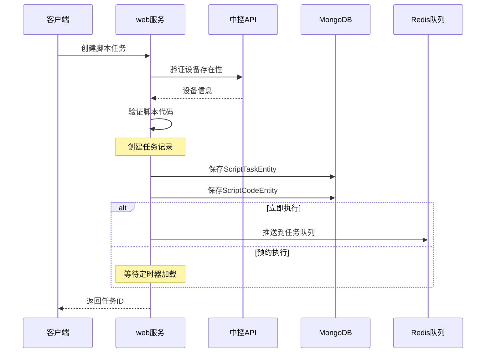
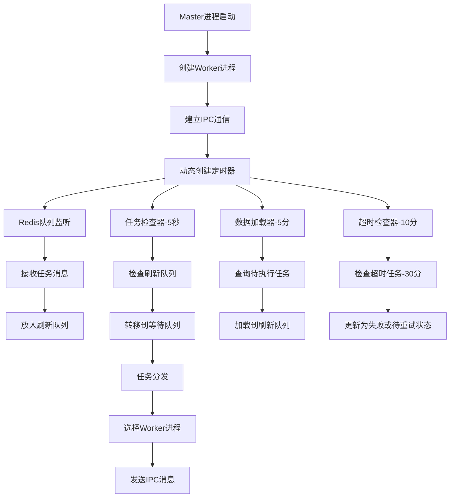
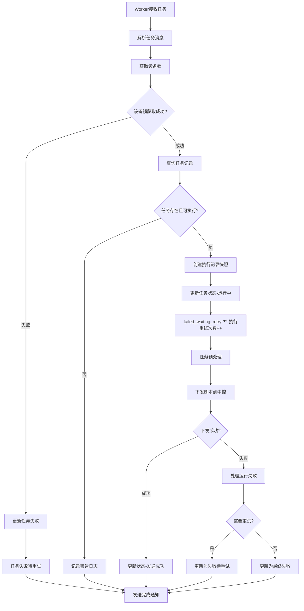
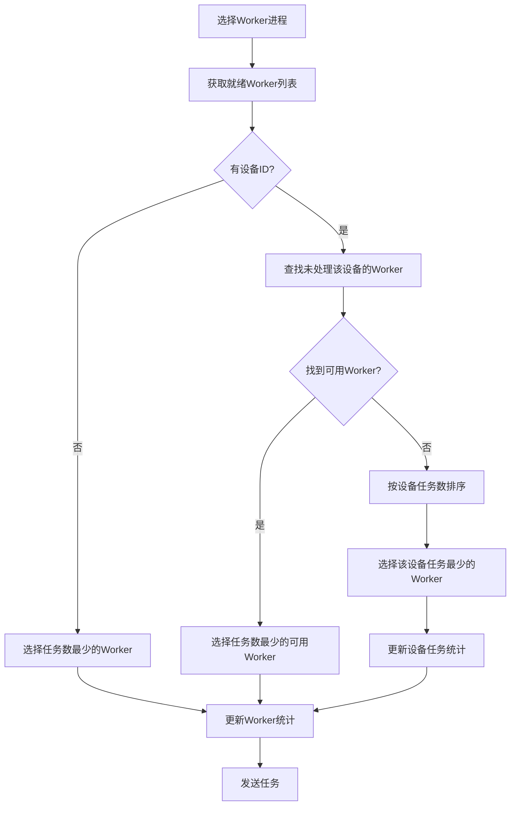
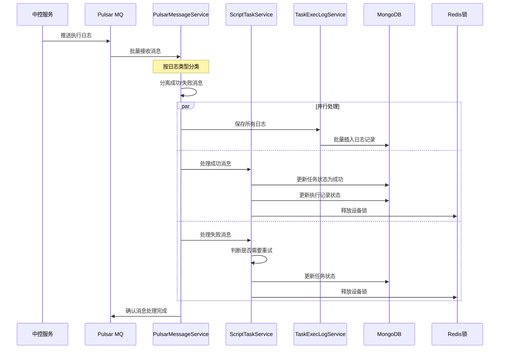
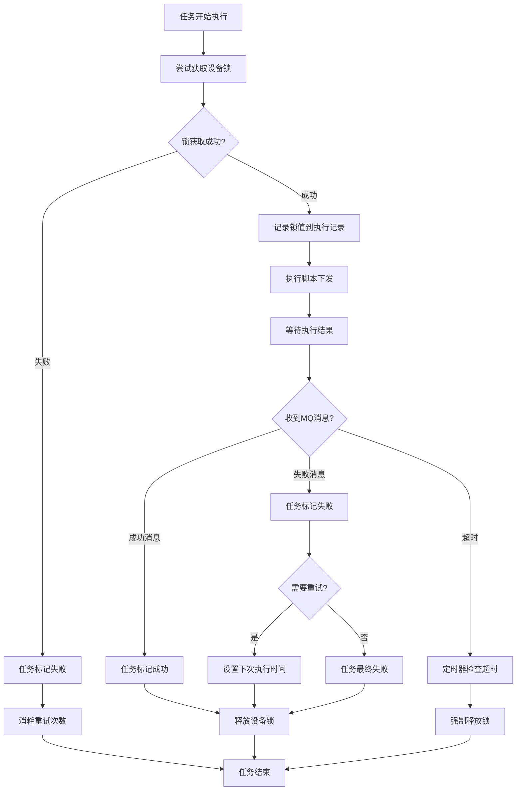
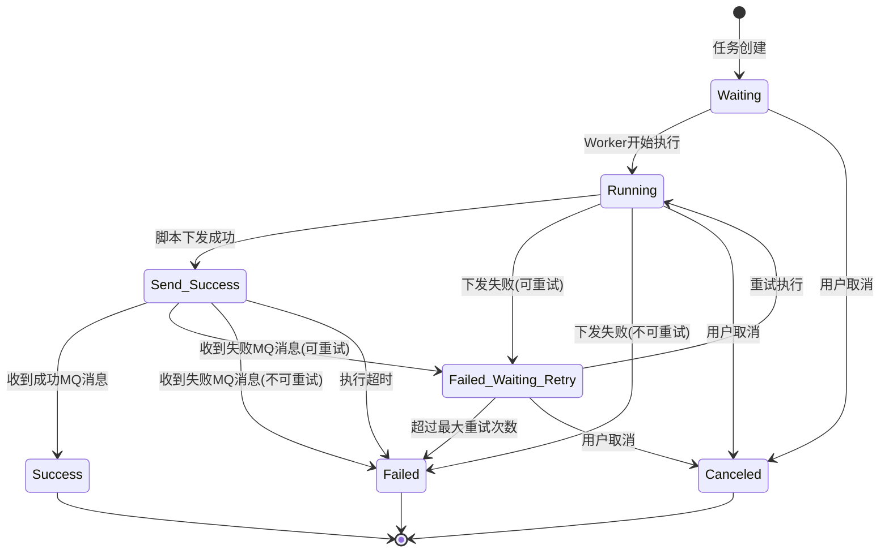
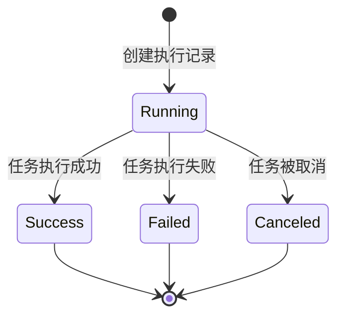
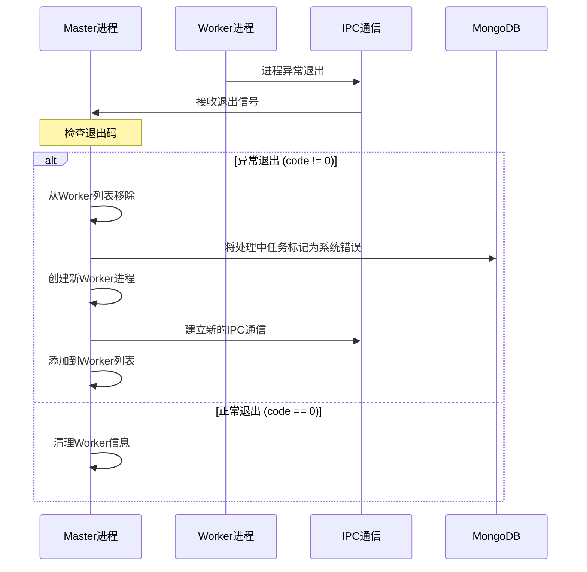
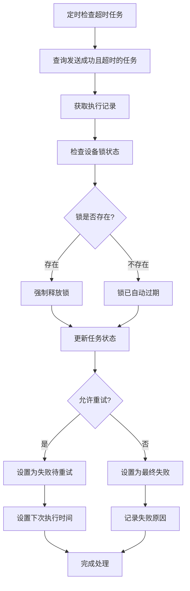

# 脚本下发服务业务流程图

## 1. 详细流程图

### 1.1 任务创建与入队流程

### 2.2 Master进程任务调度流程

### 2.3 Worker进程任务处理流程

### 2.4 负载均衡算法流程

### 2.5 MQ消息处理流程

### 2.6 设备锁管理流程

## 3. 状态流转图

### 3.1 任务状态流转

### 3.2 执行记录状态流转

## 4. 异常处理流程

### 4.1 Worker进程故障恢复

### 4.2 设备锁超时处理

---

*文档版本: v1.0*  
*最后更新: 2025-09-29*